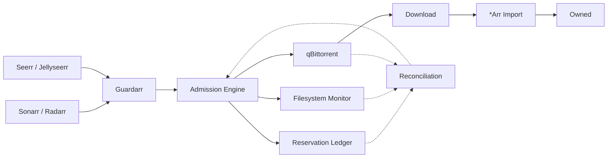

# Guardarr

<div align="center">

### Storage Admission & Protection for the *Arr ecosystem

**Prevent concurrent automated media downloads from exceeding a defined storage budget.**

<p>
  
</p>

[](https://github.com/n3phz/guardarr)
[](https://fastapi.tiangolo.com/)
[](https://github.com/n3phz/guardarr)

</div>

---

## The problem

The *Arr ecosystem is very good at deciding **what** to download.

The harder problem is deciding **whether multiple automated requests can safely be admitted without exhausting storage**.

A simple free-space check is not enough when requests arrive concurrently:

```text
Free:                 800 GB

Request A:            300 GB  →  ALLOW
Request B:            300 GB  →  ALLOW
Request C:            300 GB  →  DENY
```

Without persistent reservations, all three requests can see the same 800 GB of free space and independently conclude that they can proceed.

Guardarr introduces a storage admission layer between the request and the downloader.

## The Guardarr thesis

> **Guardarr prevents concurrent automated media downloads from exceeding a defined storage budget.**

The core idea is deliberately narrow:

**check → reserve → admit → observe → reconcile → release**

The reservation ledger is the centre of the system. Integrations exist to make that ledger reliable across the *Arr ecosystem.

Guardarr is **not** another downloader, cleanup system, retention manager, or AI agent.

## How it works



**Reservation happens before admission.**

The system therefore accounts for concurrent requests before they are allowed to consume additional storage.

## Reservation lifecycle

```text
                    ┌──────────────┐
                    │   REQUEST    │
                    └──────┬───────┘
                           │
                           ▼
                    ┌──────────────┐
                    │   RESERVED   │
                    └──────┬───────┘
                           │
                 controlled admission
                           │
                           ▼
                    ┌──────────────┐
                    │    ACTIVE    │
                    └──────┬───────┘
                           │
                         import
                           │
                           ▼
                    ┌──────────────┐
                    │    OWNED     │
                    └──────┬───────┘
                           │
                         release
                           │
                           ▼
                    ┌──────────────┐
                    │   RELEASED   │
                    └──────────────┘
```

Reservations are persistent and auditable rather than being a transient calculation made at request time.

## What Guardarr does

### Core

- **Storage admission** — determines whether a request fits within the available storage budget
- **Reservations** — holds capacity for accepted requests
- **Concurrency control** — accounts for multiple outstanding requests at the same time
- **Lifecycle tracking** — follows reservations from request through import
- **Reconciliation** — compares reservations with filesystem and download reality
- **Fail-closed admission** — refuses new admissions when storage safety cannot be verified

### Ecosystem integration

- **qBittorrent control** — performs controlled admission and deterministic tagging
- **Sonarr / Radarr** — connects media acquisition to the reservation lifecycle
- **Seerr / Jellyseerr** — provides request-layer integration
- **Bypass detection** — identifies unexpected or unreserved qBittorrent activity

### Conservative storage accounting

Storage ownership is not always perfectly observable.

Hardlinks, cross-seeds, incomplete downloads, imports and external writers can make exact accounting difficult. Guardarr therefore prefers **conservative accounting over optimistic assumptions**.

> When storage ownership cannot be safely determined, Guardarr assumes the more conservative interpretation.

## What Guardarr does *not* do

Guardarr deliberately has a narrow responsibility.

| Component | Responsibility |
|---|---|
| **Guardarr** | Storage admission & protection |
| **qui** | Torrent lifecycle |
| **Reclaimerr** | Media retention |
| **qBittorrent** | Downloading |
| **Sonarr / Radarr** | Media acquisition & library management |
| **Seerr / Jellyseerr** | User requests |

Guardarr does not attempt to replace these systems.

It protects the boundary between **automated requests** and **storage consumption**.

## Safety model

Guardarr treats storage safety as a **deterministic control problem**.

### Core principles

- Storage safety is deterministic.
- AI and agents are **never** the safety authority.
- Reservations are persistent and auditable.
- Concurrent requests are accounted for before admission.
- Hardlinks and cross-seeds are handled conservatively.
- Existing downloads are not deleted by Guardarr.
- New admissions fail closed when safety cannot be established.
- Cleanup and retention remain outside Guardarr.
- AI/orchestration cannot override a storage admission decision.

AI agents may eventually help operate or explain Guardarr, but the safety boundary remains deterministic.

## Built for the *Arr ecosystem

Guardarr is designed around the existing ecosystem rather than replacing it.

```text
                    ┌──────────────────────────┐
                    │      User / Request      │
                    └────────────┬─────────────┘
                                 │
                       Seerr / Jellyseerr
                                 │
                                 ▼
┌───────────────┐         ┌───────────────┐         ┌───────────────┐
│    Sonarr     │────────▶│    Guardarr   │◀────────│    Radarr     │
└───────────────┘         └───────┬───────┘         └───────────────┘
                                  │
                                  ▼
                           ┌───────────────┐
                           │  qBittorrent  │
                           └───────┬───────┘
                                   │
                                   ▼
                              Downloads
                                   │
                                   ▼
                              *Arr Import
                                   │
                                   ▼
                                Library

        ┌───────────────┐                    ┌───────────────┐
        │      qui      │                    │   Reclaimerr  │
        │ Torrent life  │                    │ Media retention│
        └───────────────┘                    └───────────────┘
```

## MVP scope

The first Guardarr release is intentionally focused.

### In scope

- Storage monitoring and threshold state
- Reservation-ledger backed admission
- qBittorrent controlled admission and tagging
- Sonarr / Radarr request interception
- Seerr / Jellyseerr request integration
- Reconciliation between reservations, filesystem, and download state
- REST API for health, readiness, and status
- Docker deployment

### Out of scope

- Media retention or deletion policies
- Replacing *Arr download clients
- AI-based admission decisions
- Autonomous override of storage safety checks

## Features

- **Storage Monitoring** — Real-time filesystem statistics via `statvfs`
- **Threshold Management** — Configurable admission floor, warning, emergency, and critical thresholds
- **Inode Tracking** — Monitor inode exhaustion
- **REST API** — FastAPI-based endpoints for health, readiness, and status
- **Docker** — Single-container deployment with Docker Compose

## Quick Start

```bash
cp .env.example .env
docker compose up -d
```

## Configuration

| Variable | Default | Description |
|----------|---------|-------------|
| `GUARDARR_DATA_DIR` | `/config` | Data directory for configuration and database |
| `GUARDARR_STORAGE_PATH` | `/data` | Path to monitored storage |
| `WARNING_THRESHOLD_BYTES` | `1000000000000` (1 TB) | Warning threshold |
| `ADMISSION_FLOOR_BYTES` | `750000000000` (750 GB) | Admission floor |
| `EMERGENCY_THRESHOLD_BYTES` | `500000000000` (500 GB) | Emergency threshold |
| `CRITICAL_THRESHOLD_BYTES` | `250000000000` (250 GB) | Critical threshold |
| `DATABASE_URL` | `sqlite:////config/guardarr.db` | Database URL |
| `TZ` | `UTC` | Timezone |

## API Endpoints

- `GET /api/health` — Health check
- `GET /api/ready` — Readiness check with filesystem validation
- `GET /api/status` — Full status with thresholds and inodes

## Threshold States

| State | Condition |
|-------|-----------|
| `NORMAL` | Available > Warning threshold |
| `WARNING` | Available ≤ Warning threshold |
| `BLOCKED` | Available ≤ Admission floor |
| `EMERGENCY` | Available ≤ Emergency threshold |
| `CRITICAL` | Available ≤ Critical threshold |

## Development

```bash
pip install -e ".[dev]"
pytest
```

## License

MIT

---

**Guardarr** · Storage Admission & Protection for the *Arr ecosystem

[GitHub](https://github.com/n3phz/guardarr)

</div>
