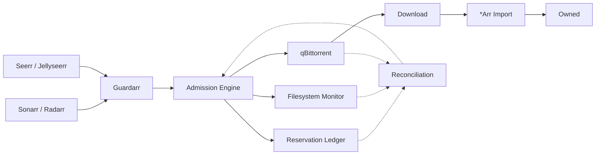

# Guardarr

<div align="center">

### Storage Admission & Protection for the *Arr ecosystem

**Prevent storage exhaustion before the next download becomes a problem.**

[](https://github.com/n3phz/guardarr)
[](https://fastapi.tiangolo.com/)
[](https://github.com/n3phz/guardarr)

</div>

---

## Why Guardarr?

The *Arr ecosystem is very good at deciding **what** to download.

It is not designed to be the system that decides **whether there is enough storage to safely download it**.

Guardarr sits at that boundary.

It evaluates available storage, reserves capacity, controls admission into qBittorrent, and tracks the request until the media becomes owned by the library.

> **Guardarr is the storage safety layer — not another downloader, cleanup tool, or AI agent.**

## How it works



The important distinction is that **reservation happens before admission**.

A request can therefore be rejected before it consumes additional storage.

## Reservation lifecycle

```text
                    ┌──────────────┐
                    │   REQUEST    │
                    └──────┬───────┘
                           │
                           ▼
                    ┌──────────────┐
                    │   RESERVED   │
                    └──────┬───────┘
                           │
                 controlled admission
                           │
                           ▼
                    ┌──────────────┐
                    │    ACTIVE    │
                    └──────┬───────┘
                           │
                         import
                           │
                           ▼
                    ┌──────────────┐
                    │    OWNED     │
                    └──────┬───────┘
                           │
                         release
                           │
                           ▼
                    ┌──────────────┐
                    │   RELEASED   │
                    └──────────────┘
```

Reservations are persistent and auditable, rather than being a transient calculation made at request time.

## What Guardarr does

- **Storage admission** — checks available capacity before accepting new downloads
- **Reservations** — holds capacity for requested content
- **Lifecycle tracking** — follows reservations from request through import
- **qBittorrent control** — performs controlled admission and deterministic tagging
- **Reconciliation** — compares reservation, filesystem and download state
- **Arr integration** — works with Sonarr and Radarr
- **Request integration** — supports Seerr and Jellyseerr
- **Bypass detection** — identifies unexpected/unreserved qBittorrent activity
- **Fail-closed admission** — refuses new admissions when storage safety cannot be verified

## What Guardarr does *not* do

Guardarr deliberately has a narrow responsibility.

| Component | Responsibility |
|---|---|
| **Guardarr** | Storage admission & protection |
| **qui** | Torrent lifecycle |
| **Reclaimerr** | Media retention |
| **qBittorrent** | Downloading |
| **Sonarr / Radarr** | Media acquisition & library management |
| **Seerr / Jellyseerr** | User requests |

This separation prevents storage admission, torrent lifecycle and media retention from becoming one large system with overlapping authority.

## Safety model

Guardarr treats storage safety as a **deterministic control problem**.

### Core principles

- Storage safety is deterministic.
- AI and agents are **never** the safety authority.
- Reservations are persistent and auditable.
- Hardlinks and cross-seeds are handled conservatively.
- Existing downloads are not deleted by Guardarr.
- New admissions fail closed when safety cannot be established.
- Emergency protection is independent of AI/orchestration.

That means an AI agent can help operate the surrounding infrastructure, but it cannot simply override Guardarr's storage decision.

## Built for the *Arr ecosystem

Guardarr is designed around the existing ecosystem rather than replacing it.

```text
                    ┌──────────────────────────┐
                    │      User / Request      │
                    └────────────┬─────────────┘
                                 │
                       Seerr / Jellyseerr
                                 │
                                 ▼
┌───────────────┐         ┌───────────────┐         ┌───────────────┐
│    Sonarr     │────────▶│    Guardarr   │◀────────│    Radarr     │
└───────────────┘         └───────┬───────┘         └───────────────┘
                                  │
                                  ▼
                           ┌───────────────┐
                           │  qBittorrent  │
                           └───────┬───────┘
                                   │
                                   ▼
                              Downloads
                                   │
                                   ▼
                              *Arr Import
                                   │
                                   ▼
                                Library

        ┌───────────────┐                    ┌───────────────┐
        │      qui      │                    │   Reclaimerr  │
        │ Torrent life  │                    │ Media retention│
        └───────────────┘                    └───────────────┘
```

## Project status

Guardarr is under active development.

The current implementation includes the core:

- admission and reservation layer
- persistent reservation lifecycle
- qBittorrent integration
- Sonarr / Radarr integration
- Seerr / Jellyseerr integration
- reconciliation and safety checks

The project is still being verified and hardened before a broader release.

## Philosophy

Guardarr follows one simple rule:

> **Never let an automated download consume storage that the system has not safely admitted.**

Everything else should remain someone else's job.

---

<div align="center">

**Guardarr** · Storage Admission & Protection for the *Arr ecosystem

[GitHub](https://github.com/n3phz/guardarr)

</div>
