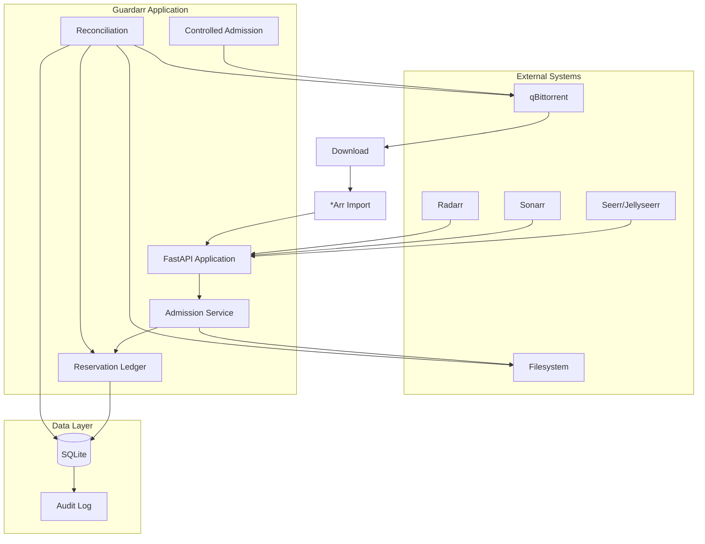

# Architecture Overview

## High-Level Architecture



---

## Technology Stack

| Layer | Technology |
|-------|------------|
| Web Framework | FastAPI 0.109+ |
| Database | SQLite (SQLAlchemy 2.0) |
| ORM | SQLAlchemy 2.0 (async) |
| Validation | Pydantic 2 |
| HTTP Client | Requests (sync) |
| Filesystem | os.statvfs |
| Container | Python 3.13 slim |
| Orchestration | Docker / Saltbox |

---

## Module Structure

```
app/
├── api/              # FastAPI routers
│   ├── health.py     # /api/health
│   ├── ready.py      # /api/ready
│   ├── status.py     # /api/status
│   ├── reservations.py  # /api/estimate, /api/admit, /api/reconcile
│   ├── qbittorrent.py   # /api/qbittorrent/*
│   ├── controlled_add.py # /api/qbittorrent/reservations/{id}/add
│   ├── arr.py       # /api/arr/* (Sonarr/Radarr)
│   └── seerr.py     # /api/seerr/* (Seerr/Jellyseerr)
├── core/
│   ├── config.py    # Settings, thresholds, validation
│   ├── filesystem.py # statvfs wrapper
│   └── thresholds.py # ThresholdState, ThresholdConfig
├── db/
│   ├── base.py      # SQLAlchemy engine, session
│   └── models.py    # ReservationModel, AuditLogModel, ReconcileStateModel
├── schemas/         # Pydantic request/response models
├── services/        # Business logic
│   ├── admission.py
│   ├── reconciliation.py
│   ├── qbittorrent.py
│   ├── qbittorrent_reconciliation.py
│   ├── controlled_admission.py
│   ├── arr_orchestration.py
│   └── seerr_orchestration.py
├── integrations/
│   ├── arr/
│   │   └── base.py  # Sonarr/Radarr clients
│   └── seerr/
│       └── base.py  # Seerr/Jellyseerr clients
└── main.py          # FastAPI app factory, lifespan
```

---

## Request Flow

### Admission Path
```
POST /api/seerr/admit
       ↓
SeerrOrchestrationService.admit()
       ↓
AdmissionService.admit()
       ↓
BEGIN IMMEDIATE transaction
       ↓
Check idempotency
Calculate outstanding unfulfilled
Get filesystem stats (statvfs)
Calculate projected available
Check >= admission_floor
       ↓
Create ReservationModel
COMMIT
       ↓
Return reservation_id, state=RESERVED
```

### Controlled Add Path
```
POST /api/qbittorrent/reservations/{id}/add
       ↓
ControlledAdmissionService.controlled_add()
       ↓
Extract magnet hash
       ↓
QBittorrentClient.login()
       ↓
qBittorrent: POST /api/v2/torrents/add
       ↓
qBittorrent: POST /api/v2/torrents/setTag
       ↓
Update reservation: state=ACTIVE, torrent_tag, torrent_metadata_hash
```

---

## Concurrency Control

### Transaction Isolation
```python
# All critical operations use BEGIN IMMEDIATE
db.execute(text("BEGIN IMMEDIATE"))
# ... operations ...
db.commit()
```

**BEGIN IMMEDIATE** acquires a reserved lock immediately, preventing other writers from starting until commit.

### Idempotency
```sql
UNIQUE(adapter_name, idempotency_key)
```
Prevents duplicate reservations from retry storms.

---

## Database

### Engine Configuration
```python
engine = create_engine(
    settings.database_url,
    connect_args={"check_same_thread": False} if sqlite else {},
)
```

**SQLite WAL mode** enabled by default for concurrent reads.

### Models
- `ReservationModel` — Core reservation entity
- `AuditLogModel` — Immutable audit trail
- `ReconcileStateModel` — Reconciliation metadata

---

## Lifespan

```python
@asynccontextmanager
async def lifespan(app: FastAPI):
    # Initialize database schema on startup
    Base.metadata.create_all(bind=engine)
    yield
```

Runs once at startup — ensures tables exist for fresh installs (0.1.2 fix).

---

## Next: [API Reference](api.md)
