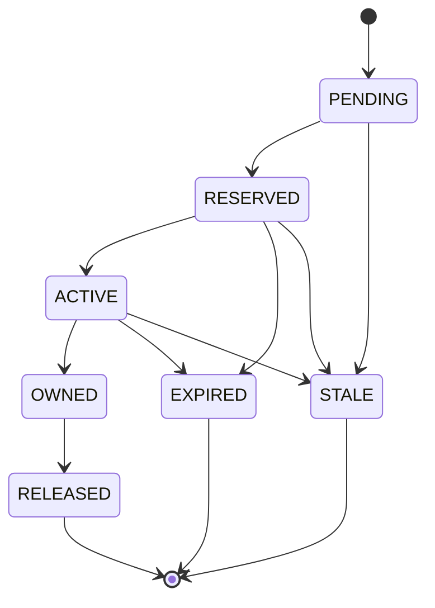

# Reservation Lifecycle

## State Machine



## States

| State | Description | Capacity Held |
|-------|-------------|---------------|
| `PENDING` | Created, not yet admitted | Yes (admission in progress) |
| `RESERVED` | Admitted, awaiting controlled add | Yes |
| `ACTIVE` | Torrent added to qBittorrent, downloading | Yes (dynamic) |
| `OWNED` | Import complete, media in library | Yes (until released) |
| `RELEASED` | Capacity explicitly returned | No |
| `EXPIRED` | TTL elapsed, auto-released | No |
| `STALE` | Orphaned/inconsistent, needs attention | No (after reconciliation) |

---

## State Transitions

### PENDING → RESERVED
**Trigger:** Successful admission (`/api/seerr/admit`, `/api/arr/admit`)
- Idempotency key verified unique
- Projected available >= admission floor
- DB transaction commits

### RESERVED → ACTIVE
**Trigger:** Controlled add (`/api/qbittorrent/reservations/{id}/add`)
- Torrent added to qBittorrent
- Tag `guardarr:{reservation_id}` applied
- `torrent_metadata_hash` recorded
- `torrent_tag` recorded

### ACTIVE → OWNED
**Trigger:** Import confirmation (`/api/seerr/{id}/imported`, `/api/arr/{id}/imported`)
- *Arr reports import complete
- `arr_item_id` recorded
- `associated_path` recorded
- `observed_materialized_bytes` = `expected_bytes`

### OWNED → RELEASED
**Trigger:** Manual release (`/api/seerr/{id}/release`, `/api/arr/{id}/release`)
- Explicit operator action
- `remaining_unfulfilled_bytes` = 0
- Capacity returned to pool

### RESERVED/ACTIVE → EXPIRED
**Trigger:** Reconciliation detects `expires_at < now`
- Automatic during reconciliation
- `remaining_unfulfilled_bytes` = 0
- Audit log entry created

### Any → STALE
**Trigger:** Reconciliation detects orphaned/inconsistent state
- Reservation exists but no matching torrent
- Or torrent exists but no active reservation
- Requires operator attention

---

## Capacity Accounting

### While Reserved (PENDING/RESERVED/ACTIVE)
```python
reserved_capacity = max_bytes - observed_materialized_bytes
# For HARDLINK imports: capacity held until explicitly released
# For COPY imports: capacity reduces as materialized bytes increase
```

### After Owned (OWNED)
```python
reserved_capacity = max_bytes  # Held until release
```

### After Released/Expired (RELEASED/EXPIRED)
```python
reserved_capacity = 0  # Returned to pool
```

---

## TTL Behavior

- `ttl_seconds` optional on admission
- If provided: `expires_at = created_at + ttl_seconds`
- If omitted: no automatic expiry (manual release required)
- Reconciliation checks TTL every run

---

## Import Modes

| Mode | Capacity Behavior |
|------|-------------------|
| `hardlink` | Full `max_bytes` reserved until release; hardlinks don't consume additional space |
| `copy` | Capacity reduces as `observed_materialized_bytes` increases |
| `unknown` | Conservative: full `max_bytes` held |

---

## Reconciliation Actions

| Condition | Action |
|-----------|--------|
| `expires_at < now` AND state in [PENDING, RESERVED, ACTIVE] | → EXPIRED |
| `remaining_unfulfilled_bytes < 0` | → zeroed |
| Active reservation, no matching torrent in qBittorrent | → flagged |
| Torrent in qBittorrent with guardarr tag, no active reservation | → unreserved |

---

## Next: [Safety Model](safety.md)
