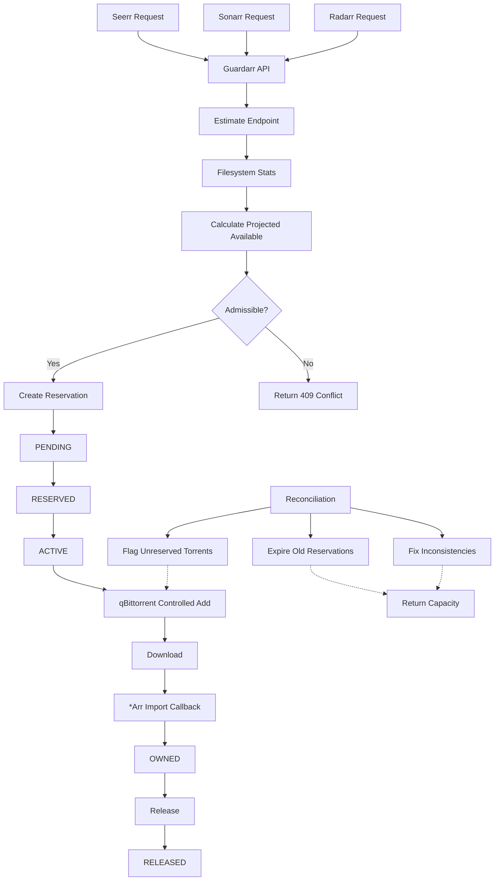

# Workflow Overview

## Complete Flow



---

## Step-by-Step

### 1. Request Arrives
External system (Seerr/Sonarr/Radarr) calls `/api/seerr/estimate` or `/api/arr/estimate`

```json
POST /api/seerr/estimate
{
  "provider": "seerr",
  "request_id": "abc123",
  "estimated_size_bytes": 300000000000,
  "target_device": "/data"
}
```

### 2. Estimate (Pre-Admission Check)
Guardarr checks filesystem and calculates:
- `available_bytes` — from `statvfs`
- `outstanding_unfulfilled_bytes` — sum of active reservations
- `projected_available = available - outstanding - requested`

If `projected_available >= admission_floor`: **admissible**

### 3. Admission
If admissible, client calls `/api/seerr/admit`:

```json
POST /api/seerr/admit
{
  "provider": "seerr",
  "request_id": "abc123",
  "max_bytes": 300000000000,
  "expected_bytes": 280000000000,
  "target_device": "/data",
  "import_mode": "hardlink",
  "ttl_seconds": 86400
}
```

Guardarr creates reservation with state `PENDING` → `RESERVED`

### 4. Controlled Add to qBittorrent
Client (or external orchestrator) calls `/api/qbittorrent/reservations/{id}/add`:

```json
POST /api/qbittorrent/reservations/{id}/add
{
  "url_or_magnet": "magnet:?xt=urn:btih:...",
  "savepath": "/data/media/movies/Movie (2024)",
  "idempotency_key": "abc123"
}
```

Guardarr:
1. Adds torrent to qBittorrent with tag `guardarr:{reservation_id}`
2. Sets save path
3. Updates reservation state: `RESERVED` → `ACTIVE`
4. Sets `torrent_metadata_hash` and `torrent_tag`

### 5. Download Progress
qBittorrent downloads. Guardarr reconciliation:
- Polls qBittorrent for torrent progress
- Updates `observed_materialized_bytes`
- Recalculates `remaining_unfulfilled_bytes`

### 6. Import Complete
*Arr (Sonarr/Radarr) calls import confirmation:

```json
POST /api/arr/{reservation_id}/imported
{
  "arr_item_id": "12345",
  "torrent_metadata_hash": "abc123...",
  "associated_path": "/data/media/movies/Movie (2024)/movie.mkv"
}
```

Guardarr updates state: `ACTIVE` → `OWNED`

### 7. Release / Expiry
- **Manual release**: `POST /api/arr/{id}/release`
- **TTL expiry**: Reconciliation marks `EXPIRED`
- **Stale detection**: Orphaned reservations → `STALE`

Capacity returned to available pool.

---

## Key Invariants

| Invariant | Enforced By |
|-----------|-------------|
| No duplicate `idempotency_key` per adapter | Unique DB index |
| `remaining_unfulfilled_bytes >= 0` | Reconciliation fix |
| `projected_available >= admission_floor` at admit time | Transaction `BEGIN IMMEDIATE` |
| Torrent hash unique per active reservation | Association check |
| State transitions follow allowed paths | Application logic |

---

## Next: [Reservation Lifecycle](lifecycle.md)
