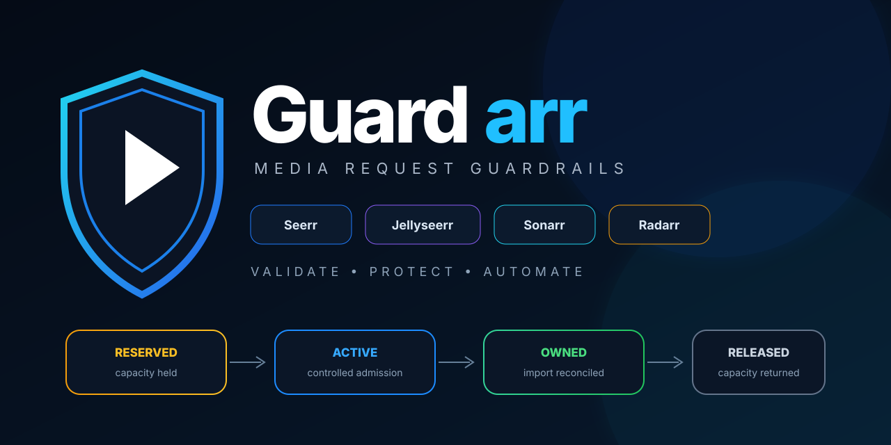
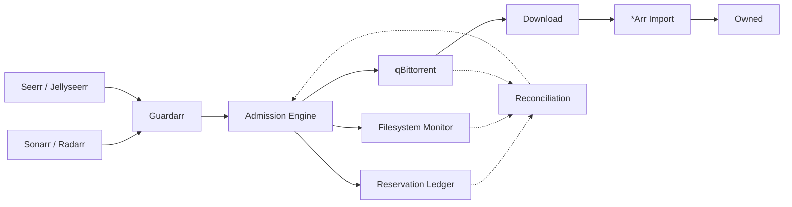

# Guardarr

<div align="center" markdown="1">

### Storage Admission & Protection for the *Arr ecosystem

**Prevent concurrent automated media downloads from exceeding your defined storage budget.**

<p>
  
</p>

[](https://github.com/n3phz/guardarr/releases/tag/0.1.2)
[](https://github.com/n3phz/guardarr)
[](https://fastapi.tiangolo.com/)
[](https://github.com/n3phz/guardarr)
[](https://ghcr.io/n3phz/guardarr)
[](LICENSE)

</div>

---

## What is Guardarr?

**Guardarr is a storage-admission and reservation layer for automated media downloads.**

It prevents Seerr, Sonarr, and Radarr requests from blindly starting downloads when the storage budget cannot safely accommodate them.

### The Core Problem

```
Free:                 800 GB

Request A:            300 GB  →  ALLOW
Request B:            300 GB  →  ALLOW
Request C:            300 GB  →  DENY (would exceed budget)
```

Without persistent reservations, all three requests can see the same 800 GB of free space and independently conclude they can proceed — leading to storage exhaustion.

### Guardarr's Solution

```
Request → Guardarr Admission → Storage Check → Reservation → qBittorrent → Download → Reconciliation → Owned/Released/Expired
```

**Reservations happen before admission.** The system accounts for concurrent requests before they are allowed to consume additional storage.

---

## Quick Links

| Section | Description |
|---------|-------------|
| [Problem Statement](problem/storage-problem.md) | Why storage admission matters |
| [How It Works](how-it-works/workflow.md) | Visual workflow and lifecycle |
| [Integrations](integrations/overview.md) | Seerr, Sonarr, Radarr, qBittorrent |
| [Storage Safety](storage/thresholds.md) | Thresholds, admission, reconciliation |
| [Docker Deployment](deployment/docker.md) | Quick start with Docker Compose |
| [Saltbox Deployment](deployment/saltbox.md) | Saltbox-specific deployment |
| [Configuration](deployment/configuration.md) | All environment variables |
| [Security](deployment/security.md) | Deployment architecture |
| [Verification](verification/health.md) | Health checks and integration tests |
| [Troubleshooting](troubleshooting/common.md) | Common issues and solutions |
| [API Reference](architecture/api.md) | Technical API documentation |

---

## Current Release: **0.1.2**

- **Image:** `ghcr.io/n3phz/guardarr:0.1.2`
- **Digest:** `sha256:a3ff5813311f39d1610b4d956fea48a6f05fc38d3af7313343cf1f77a1a29077`
- **Changelog:** [0.1.2](https://github.com/n3phz/guardarr/blob/main/CHANGELOG.md#012---2026-09-27) — Database initialization fix

---

## Architecture at a Glance



---

## Guardarr Does / Does Not

| ✅ Guardarr Does | ❌ Guardarr Does Not |
|------------------|----------------------|
| Storage admission & protection | Replace downloaders (qBittorrent) |
| Persistent reservations | Media retention/deletion (Reclaimerr) |
| Concurrency control | Torrent lifecycle management (qui) |
| Reconciliation | AI-based admission decisions |
| Fail-closed admission | Override storage safety checks |

---

## Get Started

=== "Docker Compose (Quickest)"
    ```bash
    cp .env.example .env
    docker compose up -d
    ```

=== "Saltbox"
    ```bash
    # Add guardarr to saltbox.yml tags and run:
    sudo ansible-playbook saltbox.yml --tags guardarr
    ```

=== "Verify"
    ```bash
    curl http://localhost:8000/api/health
    curl http://localhost:8000/api/ready
    curl http://localhost:8000/api/status
    ```

---

## Project Status

| Aspect | Status |
|--------|--------|
| Core admission | ✅ Stable |
| qBittorrent integration | ✅ Stable |
| Seerr/Jellyseerr | ✅ Stable |
| Sonarr/Radarr | ✅ Stable |
| Reconciliation | ✅ Stable |
| Database initialization | ✅ Fixed in 0.1.2 |
| Web UI | 🚧 Not started |

---

<div align="center" markdown="1">

**[View on GitHub](https://github.com/n3phz/guardarr) · [Docker Image](https://ghcr.io/n3phz/guardarr) · [Report Issue](https://github.com/n3phz/guardarr/issues)**

</div>
