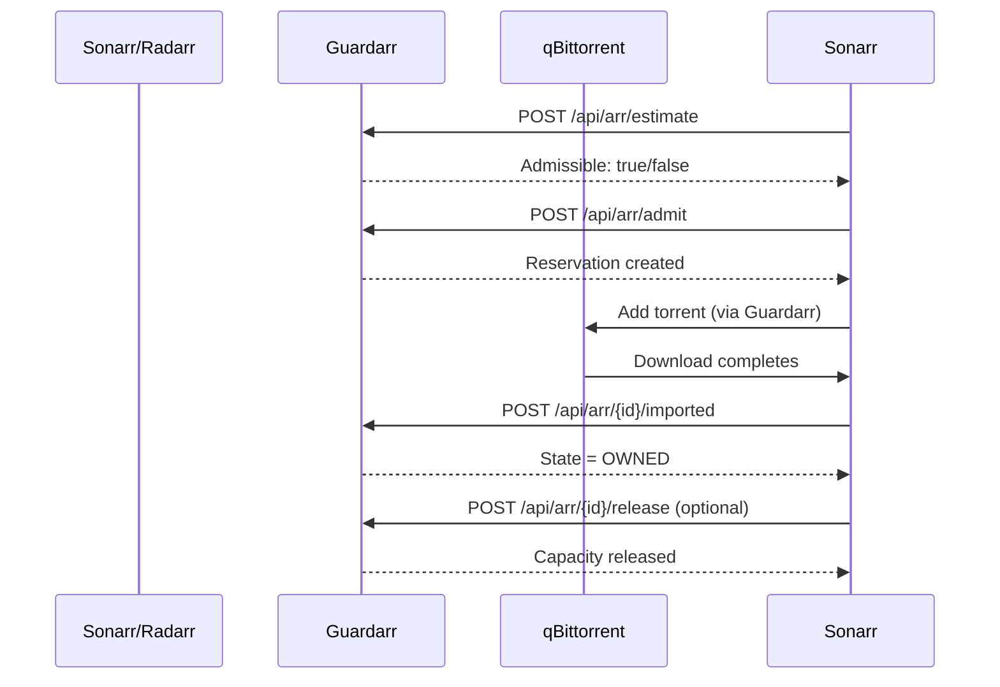

# Sonarr & Radarr Integration

## Overview

Sonarr (TV) and Radarr (Movies) are the media acquisition engines. They search indexers, find releases, and trigger downloads. Guardarr intercepts this flow to ensure storage safety.

## API Endpoints

| Method | Endpoint | Purpose |
|--------|----------|---------|
| `GET` | `/api/arr/health/{provider}` | Connectivity check |
| `POST` | `/api/arr/estimate` | Pre-admission check |
| `POST` | `/api/arr/admit` | Create reservation |
| `POST` | `/api/arr/{id}/imported` | Confirm import |
| `POST` | `/api/arr/{id}/release` | Release capacity |
| `GET` | `/api/arr/{id}` | Get reservation details |

---

## Request Flow



---

## Estimate Request

```json
POST /api/arr/estimate
{
  "provider": "sonarr",
  "content_id": "series_123",
  "arr_item_id": "episode_456",
  "estimated_size_bytes": 50000000000,
  "target_device": "/data"
}
```

---

## Admit Request

```json
POST /api/arr/admit
{
  "provider": "sonarr",
  "content_id": "series_123",
  "arr_item_id": "episode_456",
  "max_bytes": 50000000000,
  "expected_bytes": 45000000000,
  "target_device": "/data",
  "import_mode": "hardlink",
  "priority": 0,
  "ttl_seconds": 86400
}
```

---

## Import Confirmation

```json
POST /api/arr/{reservation_id}/imported
{
  "arr_item_id": "episode_456",
  "torrent_metadata_hash": "abc123def456...",
  "associated_path": "/data/media/tv/Show/Season 01/episode.mkv"
}
```

---

## Release

```json
POST /api/arr/{reservation_id}/release
{
  "reason": "Episode deleted from library"
}
```

---

## Configuration

```yaml
# Sonarr
SONARR_URL: "http://sonarr:8989"
SONARR_API_KEY: "YOUR_API_KEY"
SONARR_TIMEOUT_SECONDS: 10
SONARR_VERIFY_TLS: true

# Radarr
RADARR_URL: "http://radarr:7878"
RADARR_API_KEY: "YOUR_API_KEY"
RADARR_TIMEOUT_SECONDS: 10
RADARR_VERIFY_TLS: true
```

---

## Provider Values

| Provider | API Base Path | Header |
|----------|---------------|--------|
| `sonarr` | `/api/v3` | `X-Api-Key` |
| `radarr` | `/api/v3` | `X-Api-Key` |

---

## Sonarr/Radarr Specific Fields

| Field | Description |
|-------|-------------|
| `content_id` | Series/Movie ID in Sonarr/Radarr |
| `arr_item_id` | Episode/Movie file ID in Sonarr/Radarr |
| `associated_path` | Final filesystem path after import |

---

## Next: [qBittorrent Integration](qbittorrent.md)
