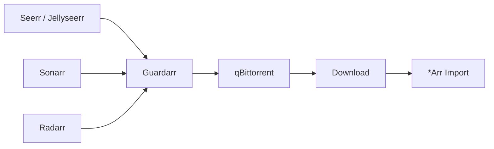

# Integrations Overview

Guardarr integrates with four external systems to provide storage admission across the *Arr ecosystem.



---

## Integration Roles

| System | Role | Guardarr Interaction |
|--------|------|---------------------|
| **Seerr / Jellyseerr** | Request layer | Estimates → Admits → Imports → Releases |
| **Sonarr / Radarr** | Media acquisition | Estimates → Admits → Imports → Releases |
| **qBittorrent** | Downloader | Controlled add → Association → Reconciliation |
| **Filesystem** | Storage reality | `statvfs` for admission, reconciliation |

---

## Request Flow by Integration

### Seerr / Jellyseerr Flow
```
User Request → Seerr → Guardarr Estimate → Guardarr Admit → qBittorrent → Download → Sonarr/Radarr Import → Seerr Imported → Guardarr Owned → Release
```

### Sonarr / Radarr Flow
```
Sonarr/Radarr Search → Guardarr Estimate → Guardarr Admit → qBittorrent → Download → Import → Guardarr Owned → Release
```

---

## API Namespaces

| Integration | Base Path | Tags |
|-------------|-----------|------|
| Core Reservations | `/api` | `reservations` |
| qBittorrent | `/api/qbittorrent` | `qbittorrent`, `controlled-admission` |
| Seerr/Jellyseerr | `/api/seerr` | `seerr` |
| Sonarr/Radarr | `/api/arr` | `arr` |

---

## Shared Concepts

### Idempotency
All admission endpoints require an `idempotency_key` unique per adapter:
- Prevents duplicate reservations
- Enables safe retries
- Unique index: `(adapter_name, idempotency_key)`

### Target Device
All requests specify `target_device` (default: `/data`):
- Enables multi-mount support
- Reservations scoped to device
- Outstanding capacity calculated per device

### Import Mode
Affects capacity accounting:
- `hardlink` — Full capacity held until release
- `copy` — Capacity reduces as materialized
- `unknown` — Conservative (full capacity)

---

## Next: [Seerr & Jellyseerr](seerr.md)
