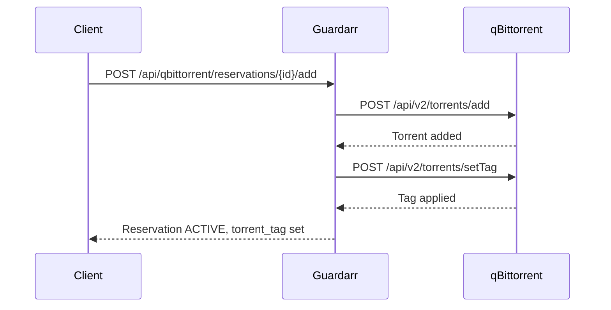

# qBittorrent Integration

## Overview

qBittorrent is the downloader. Guardarr controls admission by adding torrents with specific tags and save paths, then reconciles download state against reservations.

## API Endpoints

| Method | Endpoint | Purpose |
|--------|----------|---------|
| `GET` | `/api/qbittorrent/status` | Connectivity check |
| `POST` | `/api/qbittorrent/reservations/{id}/associate` | Link torrent to reservation |
| `POST` | `/api/qbittorrent/reservations/{id}/add` | Controlled add torrent |
| `POST` | `/api/qbittorrent/reconcile` | Reconcile torrents vs reservations |
| `GET` | `/api/qbittorrent/unreserved` | List unreserved torrents |

---

## Controlled Add Flow



---

## Controlled Add Request

```json
POST /api/qbittorrent/reservations/{reservation_id}/add
{
  "url_or_magnet": "magnet:?xt=urn:btih:abc123...",
  "savepath": "/data/media/movies/Movie (2024)",
  "category": "movies",
  "idempotency_key": "unique_key"
}
```

**Response (201 Created):**
```json
{
  "reservation_id": "uuid-here",
  "torrent_hash": "abc123def456...",
  "torrent_tag": "guardarr:uuid-here",
  "state": "ACTIVE",
  "qbittorrent_status": "added",
  "association_status": "associated",
  "recovery_info": null
}
```

---

## Torrent Association

If torrent already exists in qBittorrent:

```json
POST /api/qbittorrent/reservations/{reservation_id}/associate
{
  "torrent_hash": "abc123def456..."
}
```

---

## Reconciliation

Reconciles three sources:
1. **Reservation ledger** — What we expect
2. **Filesystem** — What exists on disk
3. **qBittorrent** — What's downloading

```json
POST /api/qbittorrent/reconcile
```

**Response:**
```json
{
  "status": "success",
  "reconciled_reservations_count": 5,
  "recovered_reservations_count": 1,
  "unreserved_torrents_count": 2,
  "unreserved_torrents": [
    {
      "hash": "abc123...",
      "name": "Movie (2024)",
      "size": 30000000000,
      "progress": 0.5,
      "state": "downloading",
      "tags": [],
      "save_path": "/data/media/movies"
    }
  ],
  "details": "Reconciled 5 reservations, recovered 1, found 2 unreserved torrents",
  "timestamp": "2026-09-27T00:00:00"
}
```

---

## Unreserved Torrents

Torrents in qBittorrent with `guardarr:*` tag but no matching active reservation:

```json
GET /api/qbittorrent/unreserved
```

---

## Configuration

```yaml
QBITTORRENT_URL: "http://qbittorrent:8080"
QBITTORRENT_USERNAME: "YOUR_USERNAME"
QBITTORRENT_PASSWORD: "YOUR_PASSWORD"
QBITTORRENT_TIMEOUT_SECONDS: 10
QBITTORRENT_VERIFY_TLS: true
QBITTORRENT_TORRENT_TAG_PREFIX: "guardarr:"
```

---

## Tagging Scheme

All Guardarr-managed torrents receive tag:
```
guardarr:{reservation_id}
```

This enables:
- Reconciliation matching
- Easy identification in qBittorrent UI
- Filtering by reservation

---

## Save Path Validation

Controlled add validates `savepath`:
- Must be absolute path
- Must not contain `..` traversal
- Must be within authorized boundaries (`/data`, `/config`)

---

## Common Issues

| Issue | Cause | Solution |
|-------|-------|----------|
| `404 Not Found` | Reservation ID invalid | Verify reservation exists |
| `400 Bad Request` | Torrent hash already claimed | Check for duplicate association |
| `503 Unavailable` | qBittorrent unreachable | Check QBITTORRENT_URL, network |
| `409 Conflict` | Save path outside boundaries | Use `/data/...` or `/config/...` |

---

## Next: [Storage Thresholds](../storage/thresholds.md)
