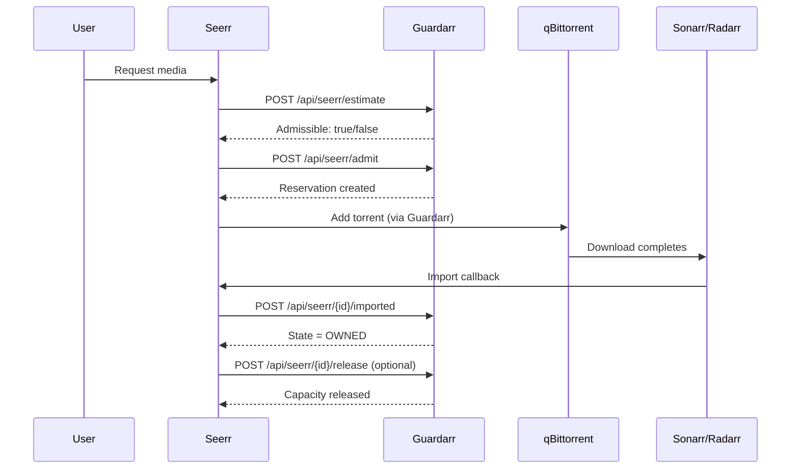

# Seerr & Jellyseerr Integration

## Overview

Seerr/Jellyseerr is the user-facing request layer. Users request media, Seerr finds it, and Guardarr admits it before downloading.

## API Endpoints

| Method | Endpoint | Purpose |
|--------|----------|---------|
| `GET` | `/api/seerr/health/{provider}` | Connectivity check |
| `POST` | `/api/seerr/estimate` | Pre-admission check |
| `POST` | `/api/seerr/admit` | Create reservation |
| `POST` | `/api/seerr/{id}/imported` | Confirm import |
| `POST` | `/api/seerr/{id}/release` | Release capacity |
| `GET` | `/api/seerr/{id}` | Get reservation details |

---

## Request Flow



---

## Estimate Request

```json
POST /api/seerr/estimate
{
  "provider": "seerr",
  "request_id": "req_abc123",
  "media_id": "12345",
  "estimated_size_bytes": 300000000000,
  "target_device": "/data"
}
```

**Response:**
```json
{
  "available_bytes": 800000000000,
  "outstanding_unfulfilled_bytes": 0,
  "requested_bytes": 300000000000,
  "projected_available_bytes": 500000000000,
  "admission_floor_bytes": 750000000000,
  "admissible": false,
  "reason": "Projected available bytes (500000000000) would fall below admission floor (750000000000)"
}
```

---

## Admit Request

```json
POST /api/seerr/admit
{
  "provider": "seerr",
  "request_id": "req_abc123",
  "media_id": "12345",
  "max_bytes": 300000000000,
  "expected_bytes": 280000000000,
  "target_device": "/data",
  "import_mode": "hardlink",
  "priority": 0,
  "ttl_seconds": 86400
}
```

**Response (201 Created):**
```json
{
  "reservation_id": "uuid-here",
  "state": "RESERVED"
}
```

---

## Import Confirmation

Called by Seerr after Sonarr/Radarr import completes:

```json
POST /api/seerr/{reservation_id}/imported
{
  "arr_item_id": "sonarr_12345",
  "torrent_metadata_hash": "abc123def456...",
  "associated_path": "/data/media/tv/Show/Season 01/episode.mkv"
}
```

**Response:**
```json
{
  "reservation_id": "uuid-here",
  "idempotency_key": "req_abc123",
  "adapter_name": "seerr",
  "content_id": "12345",
  "arr_item_id": "sonarr_12345",
  "torrent_metadata_hash": "abc123def456...",
  "associated_path": "/data/media/tv/Show/Season 01/episode.mkv",
  "target_device": "/data",
  "max_bytes": 300000000000,
  "expected_bytes": 280000000000,
  "observed_materialized_bytes": 280000000000,
  "remaining_unfulfilled_bytes": 0,
  "import_mode": "hardlink",
  "priority": 0,
  "owner": null,
  "torrent_tag": "guardarr:uuid-here",
  "state": "OWNED",
  "created_at": "2026-09-27T00:00:00",
  "updated_at": "2026-09-27T01:00:00",
  "expires_at": "2026-09-28T00:00:00"
}
```

---

## Release

```json
POST /api/seerr/{reservation_id}/release
{
  "reason": "User cancelled request"
}
```

---

## Configuration

```yaml
# Environment variables
SEERR_URL: "http://seerr:5055"
SEERR_API_KEY: "YOUR_API_KEY"
SEERR_TIMEOUT_SECONDS: 10
SEERR_VERIFY_TLS: true

# Jellyseerr (separate)
JELLYSEERR_URL: "http://jellyseerr:5056"
JELLYSEERR_API_KEY: "YOUR_API_KEY"
JELLYSEERR_TIMEOUT_SECONDS: 10
JELLYSEERR_VERIFY_TLS: true
```

---

## Provider Values

| Provider | API Base Path | Header |
|----------|---------------|--------|
| `seerr` | `/api/v1` | `X-Api-Key` |
| `jellyseerr` | `/api/v1` | `X-Api-Key` |

---

## Common Issues

| Issue | Cause | Solution |
|-------|-------|----------|
| `400 Invalid provider` | Provider not "seerr" or "jellyseerr" | Check provider field |
| `409 Conflict` | Storage below admission floor | Wait for space, increase thresholds |
| `503 Unavailable` | qBittorrent/filesystem unreachable | Check connectivity |
| `404 Not Found` | Reservation ID invalid | Verify reservation_id |

---

## Next: [Sonarr & Radarr](arr.md)
