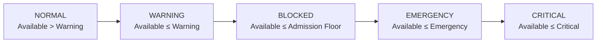

# Storage Thresholds

Guardarr uses four configurable thresholds to define storage admission behavior.

## Threshold Definitions

| Threshold | Default | Purpose |
|-----------|---------|---------|
| `WARNING_THRESHOLD_BYTES` | 1 TB (1,000,000,000,000) | Enter WARNING state |
| `ADMISSION_FLOOR_BYTES` | 750 GB (750,000,000,000) | Block new admissions |
| `EMERGENCY_THRESHOLD_BYTES` | 500 GB (500,000,000,000) | EMERGENCY state |
| `CRITICAL_THRESHOLD_BYTES` | 250 GB (250,000,000,000) | CRITICAL state |

## Ordering Requirement

**Must satisfy:** `WARNING > ADMISSION_FLOOR > EMERGENCY > CRITICAL`

Enforced at startup in `app/core/config.py`:

```python
if warning <= admission_floor:
    raise ValueError("warning threshold must be greater than admission floor")
if admission_floor <= emergency:
    raise ValueError("admission floor must be greater than emergency threshold")
if emergency <= critical:
    raise ValueError("emergency threshold must be greater than critical threshold")
```

---

## Threshold States



| State | Condition | Admission |
|-------|-----------|-----------|
| `NORMAL` | Available > Warning | ✅ Allowed |
| `WARNING` | Available ≤ Warning | ✅ Allowed (but warned) |
| `BLOCKED` | Available ≤ Admission Floor | ❌ Blocked |
| `EMERGENCY` | Available ≤ Emergency | ❌ Blocked |
| `CRITICAL` | Available ≤ Critical | ❌ Blocked |

---

## Configuration

```yaml
# Environment variables
WARNING_THRESHOLD_BYTES: 1000000000000
ADMISSION_FLOOR_BYTES: 750000000000
EMERGENCY_THRESHOLD_BYTES: 500000000000
CRITICAL_THRESHOLD_BYTES: 250000000000
```

### Human-Readable Equivalents

| Bytes | Human |
|-------|-------|
| 1,000,000,000,000 | ~931 GiB (1 TB) |
| 750,000,000,000 | ~698 GiB (750 GB) |
| 500,000,000,000 | ~465 GiB (500 GB) |
| 250,000,000,000 | ~232 GiB (250 GB) |

---

## How Thresholds Affect Admission

The admission decision uses **Admission Floor** as the hard block:

```python
# From app/services/admission.py
projected_available = available_bytes - outstanding_unfulfilled_bytes - requested_bytes
admissible = projected_available >= admission_floor_bytes
```

Other thresholds affect the **status endpoint** and **monitoring** but not the admission decision directly.

---

## Status Endpoint Output

```json
GET /api/status

{
  "total_bytes": 10995116277760,
  "available_bytes": 800000000000,
  "configured_admission_floor_bytes": 750000000000,
  "warning_threshold_bytes": 1000000000000,
  "emergency_threshold_bytes": 500000000000,
  "critical_threshold_bytes": 250000000000,
  "current_threshold_state": "WARNING",
  "inode_total": 10000000,
  "inode_available": 8000000,
  "inode_usage_percent": 20.0,
  "filesystem_identity": "/data",
  "device_identity": "0x12345678",
  "ready": true
}
```

---

## Inode Monitoring

Guardarr also tracks inode availability:

| Metric | Source |
|--------|--------|
| `inode_total` | `statvfs.f_files` |
| `inode_available` | `statvfs.f_favail` |
| `inode_usage_percent` | Calculated |

No inode thresholds are currently configurable — monitored for visibility.

---

## Choosing Thresholds

| Consideration | Recommendation |
|---------------|----------------|
| **Warning** | Early warning, no blocking |
| **Admission Floor** | Leave headroom for OS, imports, other writes |
| **Emergency** | Critical operations only |
| **Critical** | Last resort before full |

Example for 10 TB array:
```
Warning:     1 TB  (10% free)
Admission: 750 GB (7.5% free)
Emergency:  500 GB (5% free)
Critical:   250 GB (2.5% free)
```

---

## Next: [Admission Logic](admission.md)
